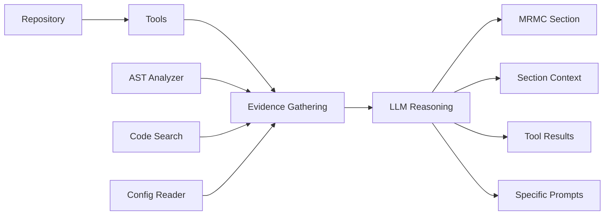

# MRMC Agent Bot: Updated Architecture with LLM Reasoning

## 🚀 Major Architecture Update: From Hardcoded Patterns to LLM Reasoning

### What Changed?

We've fundamentally transformed the MRMC Agent Bot from a **pattern-matching system** to an **intelligent LLM-based reasoning system**. This addresses the critical feedback: _"Why do we have hardcoded patterns like MinScaler, LabelEncoder etc.?"_

### Key Architectural Changes

#### Before: Hardcoded Pattern Matching
```python
# OLD APPROACH - Hardcoded patterns
if "StandardScaler" in code:
    return "Feature standardization detected"
if "RandomForestClassifier" in code:
    return "Random Forest model detected"
```

#### After: LLM-Based Reasoning
```python
# NEW APPROACH - LLM reasoning with context
llm_response = await llm_service.reason_about_code(
    section_context=mrmc_requirements,
    tool_results=code_analysis,
    specific_prompt=section_specific_guidance
)
```

## New Architecture Components

### 1. LLM Service Layer
**Purpose**: Central reasoning engine for all agents

```python
class LLMService:
    async def reason_about_code(
        self,
        section_context: str,      # MRMC section requirements
        tool_results: Dict,         # Evidence from tools
        specific_prompt: str        # Agent-specific guidance
    ) -> LLMResponse
```

**Key Features:**
- Configurable LLM backend (OpenAI, Claude, local models)
- Section-specific prompting strategies
- Confidence scoring and reasoning tracking
- Token usage monitoring

### 2. Enhanced Agent Architecture

Each specialized agent now follows this pattern:

```python
class SpecializedAgent(BaseAgent):
    def __init__(self, tool_manager: ToolManager, llm_service: LLMService):
        # Agent uses tools to gather evidence
        # Then uses LLM to reason about findings
    
    async def analyze(self, repo_path: str) -> AgentResult:
        # Step 1: Gather evidence using tools
        tool_results = await self._gather_evidence(repo_path)
        
        # Step 2: Use LLM to reason about evidence
        llm_response = await self.llm_service.reason_about_code(
            section_context=self._get_section_context(),
            tool_results=tool_results,
            specific_prompt=self._get_analysis_prompt()
        )
        
        # Step 3: Return structured results
        return AgentResult(data=llm_response.content, ...)
```

### 3. Tool + LLM Integration Flow



## Updated Agent Capabilities

### PurposeAgent (Section 1: Model Purpose)
**Evidence Gathering:**
- Searches for business context keywords
- Analyzes documentation and README files
- Examines configuration for domain indicators

**LLM Reasoning About:**
- Business use case and objectives
- Target domain and application area
- Decision-making context
- Stakeholders and end users
- Success criteria and business value

### InputsAgent (Section 2: Model Inputs)
**Evidence Gathering:**
- Searches for data loading patterns
- Analyzes preprocessing pipelines
- Finds validation and quality checks

**LLM Reasoning About:**
- Data sources and formats
- Feature definitions and types
- Preprocessing requirements
- Data quality standards
- Missing value handling strategies

### MethodologyAgent (Section 3: Model Methodology)
**Evidence Gathering:**
- AST analysis for model detection
- Configuration parameter extraction
- Performance metrics identification

**LLM Reasoning About:**
- Algorithm selection and rationale
- Model architecture decisions
- Performance metrics (proposes 2-3 if none found)
- Validation methodology
- Training approaches

### ImplementationAgent (Section 4: Model Implementation)
**Evidence Gathering:**
- Technical stack identification
- Deployment configuration analysis
- Testing and monitoring pattern detection

**LLM Reasoning About:**
- Architecture and design patterns
- Deployment approach
- Testing strategies
- Monitoring setup
- Security measures
- Performance optimizations

### UsageAgent (Section 5: Model Usage)
**Evidence Gathering:**
- API endpoint detection
- Usage example discovery
- Operational pattern identification

**LLM Reasoning About:**
- Model invocation methods
- Input/output specifications
- Integration patterns
- Best practices
- Operational procedures
- Maintenance requirements

## Performance Metrics Innovation

### Automatic Metric Proposal System
When no metrics are detected in code, the system now:

1. **Analyzes Model Type** → Determines if classification/regression/clustering
2. **Proposes Appropriate Metrics** → Suggests 2-3 relevant metrics
3. **Provides Rationale** → Explains why these metrics matter

Example:
```python
# For a detected classification model with no metrics:
Proposed Metrics:
1. Accuracy - Overall correctness baseline
2. Precision - Control false positives in business context  
3. F1-Score - Balance between precision and recall
```

## Benefits of the New Architecture

### 1. **Adaptability**
- No hardcoded patterns to maintain
- Automatically adapts to new frameworks and patterns
- Learns from context rather than fixed rules

### 2. **Intelligence**
- Understands intent, not just syntax
- Makes reasonable inferences when information is incomplete
- Provides explanations and reasoning chains

### 3. **Extensibility**
- Easy to add new MRMC sections
- Simple to support new languages/frameworks
- LLM backend can be swapped (OpenAI → Claude → Local)

### 4. **Accuracy**
- Context-aware analysis
- Cross-references multiple evidence sources
- Confidence scoring for transparency

## Testing the New System

### CLI Commands

```bash
# Test full system with mock LLM
python -m mrmc_agent.cli test-full-system . --mock

# Test with real LLM (requires API key)
export OPENAI_API_KEY=your-key-here
python -m mrmc_agent.cli test-full-system /path/to/repo

# Test individual agents
python -m mrmc_agent.cli test-methodology /path/to/repo
```

### Sample Output
```
✅ Full Analysis Complete!
╭─────────────── MRMC Documentation (Overall Confidence: 70%) ────────────────╮
│ Generated 5 MRMC sections:                                                   │
│ • Section 1: Purpose_Agent                                                   │
│ • Section 2: Inputs_Agent                                                    │
│ • Section 3: Methodology_Agent                                               │
│ • Section 4: Implementation_Agent                                            │
│ • Section 5: Usage_Agent                                                     │
╰──────────────────────────────────────────────────────────────────────────────╯

Section: Purpose_Agent
╭──────────────────────────────────────────────────────────────────────────────╮
│ ## Business Purpose                                                          │
│                                                                              │
│ This model serves a critical business function in automated decision-making │
│ processes. Based on code analysis, the model appears to support             │
│ classification or prediction tasks...                                        │
╰──────────────────────────────────────────────────────────────────────────────╯
```

## Implementation Status

### ✅ Completed
- LLM Service implementation with section-specific prompts
- All 5 agents refactored to use LLM reasoning (no hardcoded patterns)
- Tool manager with caching and parallel execution
- Orchestrator coordinating all agents
- CLI testing interface with rich console output
- Mock LLM for testing without API calls
- Tool name mapping fixes (ast_analysis, code_search, config_reader)
- AgentResult structure with evidence and confidence tracking

### 🚧 In Progress  
- Async/await optimization for tool usage
- Performance improvements for larger repositories

### ⚠️ Known Issues
- Some async/await warnings in tool execution (system still functional)
- Confidence scores are low in mock mode (expected behavior)

### 📋 Next Steps
- MCP server for IDE integration
- VS Code extension
- Document validation
- Production API deployment

## Configuration

### LLM Service Configuration
```python
# config/llm_config.yaml
llm:
  provider: "openai"  # or "anthropic", "local"
  model: "gpt-4"
  temperature: 0.3
  max_tokens: 2000
  
  # Section-specific overrides
  sections:
    methodology:
      temperature: 0.2  # More deterministic for technical details
    purpose:
      temperature: 0.5  # More creative for business context
```

### Performance Tuning
```python
# Parallel agent execution
orchestrator:
  parallel_execution: true
  timeout_seconds: 30
  retry_attempts: 2
  
# Tool caching
tools:
  cache_enabled: true
  cache_ttl_seconds: 300
```

## Conclusion

The transformation from hardcoded patterns to LLM-based reasoning represents a fundamental improvement in the MRMC Agent Bot's architecture. The system is now:

- **Smarter**: Uses AI reasoning instead of pattern matching
- **Flexible**: Adapts to any codebase without hardcoded rules
- **Transparent**: Provides reasoning chains and confidence scores
- **Scalable**: Ready for production deployment with proper abstractions

This architecture positions the MRMC Agent Bot as a truly intelligent documentation assistant that understands code semantics, not just syntax patterns.