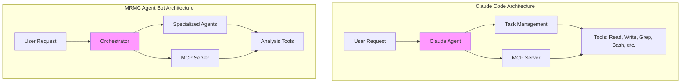

# How Claude Code Works and MRMC Agent Bot Comparison

## How Claude Code Works

Claude Code is built on several key architectural principles:

### 1. Tool-Based Architecture

Claude Code doesn't just generate text - it actively uses tools to interact with your codebase:

- **Read/Write Files** - Direct file system access
- **Search Tools** (Grep, Glob) - Find patterns and files
- **Bash Execution** - Run commands and see results
- **Web Tools** - Fetch documentation and search online
- **Git Operations** - Understand version history

### 2. Agent Behavior with Task Management

- Uses `TodoWrite` tool to plan and track complex tasks
- Breaks down requests into actionable steps
- Maintains state across multiple operations
- Can work on tasks in parallel or sequence

### 3. MCP (Model Context Protocol) Integration

- Exposes tools through standardized protocol
- Allows IDE extensions to communicate with the agent
- Provides structured tool discovery and execution

### 4. No RAG - Direct Tool Execution

Instead of searching through pre-indexed content, Claude Code:

- Directly reads files when needed
- Searches code in real-time
- Executes commands to understand the environment
- Makes decisions based on actual results, not retrieved text

## How Our MRMC Agent Bot Mirrors Claude Code

### Parallel Architecture Components

| Claude Code | MRMC Agent Bot | Purpose |
|------------|----------------|---------|
| **Core Agent** (Claude) | **Orchestrator Agent** | Coordinates all operations |
| **TodoWrite Tool** | **Task Distribution System** | Manages complex workflows |
| **File Tools** (Read, Write, Edit) | **Code Analysis Tools** (AST Parser, Config Reader) | Understand codebase |
| **Search Tools** (Grep, Glob) | **Code Search Tool** | Find patterns and files |
| **Bash Tool** | **Execution Tools** | Run commands, analyze output |
| **Web Tools** | **Documentation Extractors** | Gather external context |
| **MCP Server** | **MCP Integration** | IDE communication |

### Architectural Similarities



### Key Shared Principles

#### 1. Tool-First Approach

- **Claude Code**: Uses tools to read files, search code, run commands
- **MRMC Bot**: Uses tools to analyze AST, read configs, search patterns

#### 2. Real-Time Analysis

- **Claude Code**: Analyzes code as it reads it, no pre-indexing
- **MRMC Bot**: Explores repository in real-time, no RAG database

#### 3. Multi-Step Task Execution

- **Claude Code**: Uses TodoWrite to plan complex tasks
- **MRMC Bot**: Orchestrator coordinates multiple specialized agents

#### 4. MCP Integration

- **Claude Code**: Exposes tools via MCP for IDE integration
- **MRMC Bot**: Same MCP protocol for VS Code/Copilot integration

#### 5. Structured Output

- **Claude Code**: Produces working code with validation
- **MRMC Bot**: Produces validated MRMC documents

### Specific Implementation Parallels

```python
# Claude Code approach (simplified)
class ClaudeCode:
    def handle_request(self, request):
        # 1. Understand request
        tasks = self.plan_tasks(request)  # Like TodoWrite
        
        # 2. Execute tools
        for task in tasks:
            if task.type == "search":
                results = self.grep_tool(task.pattern)
            elif task.type == "read":
                content = self.read_tool(task.file)
            elif task.type == "analyze":
                analysis = self.analyze_code(content)
        
        # 3. Generate output
        return self.synthesize_response(results)

# MRMC Agent Bot approach
class MRMCAgentBot:
    def handle_request(self, repo_path):
        # 1. Plan analysis
        tasks = self.orchestrator.plan_analysis(repo_path)
        
        # 2. Dispatch to agents (parallel)
        results = parallel_execute([
            self.purpose_agent.analyze(tasks),
            self.inputs_agent.discover(tasks),
            self.methodology_agent.extract(tasks),
            self.implementation_agent.examine(tasks),
            self.usage_agent.determine(tasks)
        ])
        
        # 3. Generate document
        return self.orchestrator.synthesize_document(results)
```

### Why This Architecture Works

1. **Proven Pattern**: Claude Code demonstrates this architecture scales and works reliably

2. **Tool Accuracy**: Direct tool execution eliminates hallucination risks
   - Claude Code: Gets actual file contents, not approximations
   - MRMC Bot: Gets actual code structure, not guesses

3. **Adaptability**: Can handle any codebase structure
   - Claude Code: Works with any language/framework
   - MRMC Bot: Adapts to any model implementation

4. **IDE Integration**: Native developer experience
   - Claude Code: Feels like part of VS Code
   - MRMC Bot: Same seamless integration

5. **Transparency**: Users can see what tools are being used
   - Claude Code: Shows which files it reads/edits
   - MRMC Bot: Shows which code it's analyzing

### Key Differences (Enhancements)

| Aspect | Claude Code | MRMC Agent Bot |
|--------|------------|----------------|
| **Agents** | Single agent (Claude) | Multiple specialized agents |
| **Domain** | General programming | MRMC compliance specific |
| **Output** | Code/text | Structured compliance document |
| **Validation** | Syntax/tests | Regulatory compliance |
| **Tools** | General purpose | Domain-specific (AST for models) |

### Implementation Strategy Following Claude Code's Pattern

#### 1. Start with Tools (like Claude Code's foundation)

- Build robust tool suite first
- Ensure each tool returns structured data
- Make tools composable and reusable

#### 2. Add Intelligence Layer (like Claude's agent logic)

- Orchestrator that understands MRMC requirements
- Specialized agents that know what to look for
- Smart routing of tool results

#### 3. MCP Integration (like Claude's IDE integration)

- Implement same MCP protocol
- Expose tools through standard interface
- Enable `/mrmc` command in VS Code

#### 4. Validation & Output (like Claude's code generation)

- Validate against compliance requirements
- Format in required structure
- Provide audit trail

## The Core Insight

The beauty of this approach is that we're not inventing something new - we're applying Claude Code's proven architecture to a specific domain (MRMC compliance). This gives us confidence that the architecture will work because it's already working successfully in Claude Code.

### Success Factors from Claude Code

1. **Tool Reliability**: Tools provide ground truth, not approximations
2. **Composability**: Small tools combine for complex operations
3. **Transparency**: Users see what's happening at each step
4. **Integration**: Native IDE experience through MCP
5. **Adaptability**: Works with any codebase structure

### Applied to MRMC

1. **Compliance Accuracy**: Tools extract exact model parameters
2. **Section Completeness**: Specialized agents ensure all requirements met
3. **Audit Trail**: Every tool execution is logged
4. **Developer Workflow**: Same `/mrmc` simplicity as Claude Code
5. **Model Agnostic**: Works with sklearn, torch, tensorflow, custom models

## Conclusion

By following Claude Code's architectural pattern, the MRMC Agent Bot inherits:

- **Proven reliability** from a production system
- **Developer familiarity** with the Claude Code experience
- **Technical soundness** of tool-based architecture
- **Integration simplicity** through MCP protocol
- **Scalability** demonstrated by Claude Code's usage

This isn't just inspiration - it's a blueprint for success based on a working system that developers already trust and use daily.