# MRMC Governance Bot: Architecture Diagrams

## Overview

This document presents the architectural diagrams for the redesigned MRMC Bot as a comprehensive model governance platform that handles steps 3-5 of the governance workflow, with human approval as the gateway between documentation and advanced assessments.

---

## 1. Complete Governance Workflow (Corrected)

**Key Changes:**
- Bot now owns steps 3-5 as a unified platform
- Human approval is the gateway that unlocks phases 2 & 3
- Clear progression: Manual → Documentation → Approval → Assessment → Performance

---

## 2. MRMC Bot Three-Phase Architecture

---

## 3. Human Approval Gateway Detail

---

## 4. Phase 2: Immateriality Assessment Agents

---

## 5. Phase 3: Performance Framework Agents

---

## 6. Complete Bot Platform Data Flow

---

## 7. Future State Architecture Vision

```mermaid
graph TB
    subgraph "Current Implementation (Phase 1)"
        CURRENT[Documentation Generation<br/>5 Specialized Agents<br/>LLM Reasoning<br/>✅ Available Now]
    end
    
    subgraph "Planned Enhancement 1 (Phase 2)"
        PHASE2[Immateriality Assessment<br/>3 Assessment Agents<br/>Materiality Scoring<br/>🚧 6-8 weeks]
    end
    
    subgraph "Planned Enhancement 2 (Phase 3)"
        PHASE3[Performance Framework<br/>4 Performance Agents<br/>KPI Generation<br/>📋 10-12 weeks]
    end
    
    subgraph "Integration Layer"
        GATEWAY[Human Approval Gateway<br/>Review Dashboard<br/>Edit Capabilities<br/>🚧 4-6 weeks]
    end
    
    subgraph "Platform Architecture"
        ORCH[Enhanced Orchestrator<br/>Multi-phase coordination<br/>State management<br/>🚧 Continuous]
    end
    
    CURRENT --> GATEWAY
    GATEWAY --> PHASE2
    PHASE2 --> PHASE3
    ORCH -.-> CURRENT & GATEWAY & PHASE2 & PHASE3
    
    style CURRENT fill:#e8f5e8,stroke:#4caf50,stroke-width:3px
    style PHASE2 fill:#fff3e0,stroke:#ff9800,stroke-width:2px
    style PHASE3 fill:#e3f2fd,stroke:#2196f3,stroke-width:2px
    style GATEWAY fill:#fce4ec,stroke:#e91e63,stroke-width:2px
    style ORCH fill:#f3e5f5,stroke:#9c27b0,stroke-width:2px
```

---

## 8. Agent Interaction Patterns

---

## Key Architecture Decisions

### 1. **Bot as Comprehensive Platform**
- Single bot handles all automated governance steps (3-5)
- Unified orchestrator manages multi-phase workflow
- Shared context between phases eliminates redundant analysis

### 2. **Human Approval as Gateway**
- Documentation must be approved before advanced phases
- Approval unlocks immateriality and performance assessment
- Maintains human oversight while maximizing automation

### 3. **Progressive Enhancement**
- Phase 1 (Documentation): Available now
- Phase 2 (Immateriality): 6-8 weeks development
- Phase 3 (Performance): 10-12 weeks development
- Gateway interface: 4-6 weeks development

### 4. **Agent Specialization**
- Documentation agents: Code analysis and compliance writing
- Assessment agents: Materiality calculation and classification
- Performance agents: KPI definition and monitoring framework
- Shared LLM reasoning across all phases

### 5. **Data Flow Optimization**
- Phase 1 output becomes Phase 2 input
- Phase 2 classification drives Phase 3 configuration
- Shared context store eliminates redundant processing

What do you think of this architecture? Would you like me to modify any of the diagrams or add additional views?