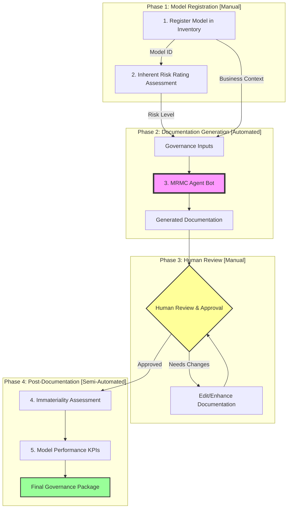
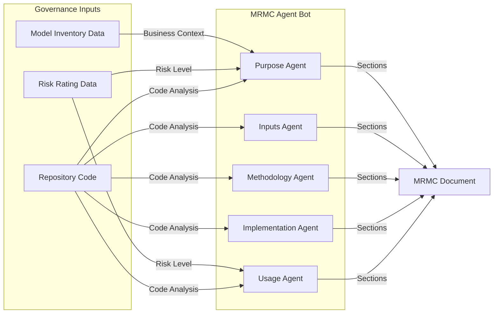
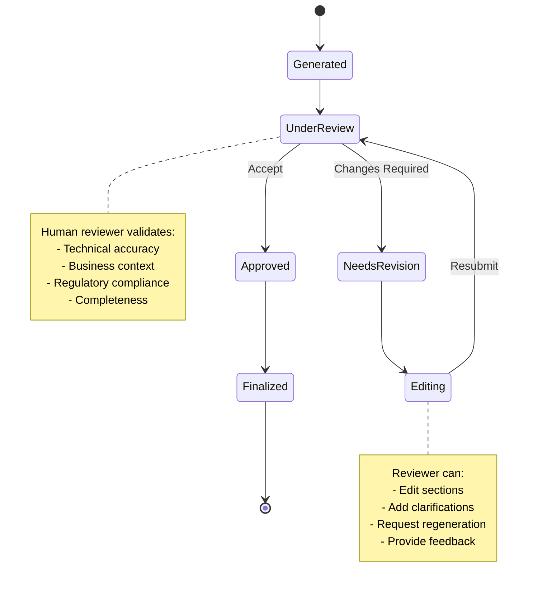
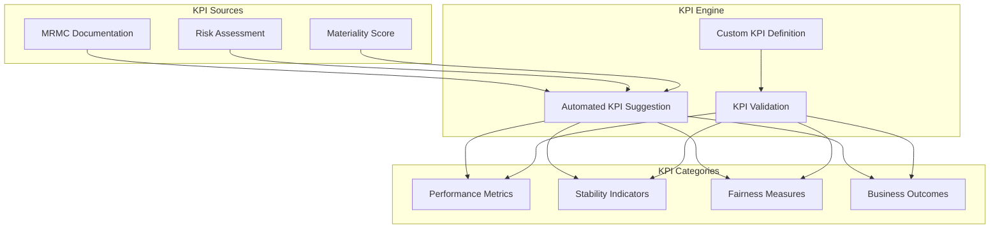
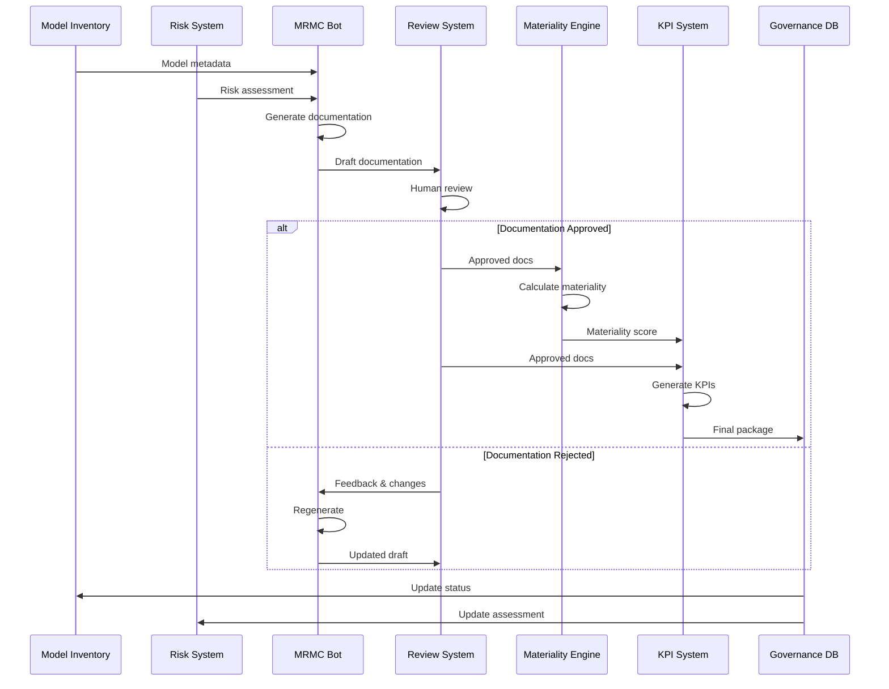
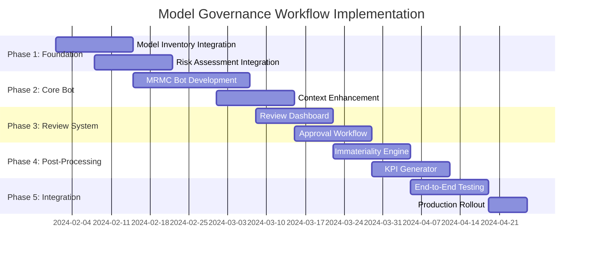

# Model Governance Workflow: End-to-End Process

## Executive Summary

This document describes the comprehensive model governance workflow that integrates the MRMC Agent Bot within a broader risk management framework. The workflow includes manual pre-processing steps, automated documentation generation, human review, and post-processing assessments.

---

## Complete Governance Workflow Overview



---

## Detailed Process Steps

### Step 1: Register Model in Inventory (Manual)

**Purpose**: Establish model identity and baseline information in the enterprise model inventory system.

**Activities**:
- Assign unique Model ID
- Record model owner and stakeholders
- Define model category and type
- Establish business unit ownership
- Set initial governance tier

**Outputs**:
```json
{
  "model_id": "MDL-2024-001",
  "model_name": "Credit Risk Scoring Model",
  "owner": "Risk Analytics Team",
  "business_unit": "Commercial Banking",
  "model_type": "Predictive",
  "category": "Credit Risk",
  "registration_date": "2024-01-15",
  "governance_tier": "Tier 1"
}
```

**Integration with MRMC Bot**:
- Model ID becomes primary key for all documentation
- Business context feeds into Purpose Agent analysis
- Owner information determines approval routing

---

### Step 2: Inherent Risk Rating Assessment (Manual)

**Purpose**: Evaluate the inherent risk level of the model based on its intended use and potential impact.

**Risk Assessment Dimensions**:

| Dimension | Low Risk | Medium Risk | High Risk |
|-----------|----------|-------------|-----------|
| **Financial Impact** | < $1M | $1M - $10M | > $10M |
| **Regulatory Exposure** | None | Moderate | Significant |
| **Data Sensitivity** | Public | Internal | PII/Confidential |
| **Decision Criticality** | Advisory | Operational | Strategic |
| **Model Complexity** | Simple | Moderate | Complex |

**Risk Rating Calculation**:
```python
class RiskAssessment:
    financial_impact: ImpactLevel
    regulatory_exposure: ExposureLevel
    data_sensitivity: SensitivityLevel
    decision_criticality: CriticalityLevel
    model_complexity: ComplexityLevel
    
    def calculate_inherent_risk(self) -> RiskLevel:
        # Weighted scoring algorithm
        score = (
            self.financial_impact * 0.3 +
            self.regulatory_exposure * 0.25 +
            self.data_sensitivity * 0.2 +
            self.decision_criticality * 0.15 +
            self.model_complexity * 0.1
        )
        return self.map_score_to_risk_level(score)
```

**Outputs**:
```json
{
  "inherent_risk_rating": "HIGH",
  "risk_score": 8.5,
  "risk_factors": {
    "financial_impact": "HIGH",
    "regulatory_exposure": "HIGH",
    "data_sensitivity": "MEDIUM",
    "decision_criticality": "HIGH",
    "model_complexity": "MEDIUM"
  },
  "risk_narrative": "High-risk model due to significant financial impact and regulatory requirements"
}
```

---

### Step 3: MRMC Documentation Generation (Automated)

**Purpose**: Automatically generate comprehensive model documentation using the MRMC Agent Bot.

#### 3.1 Input Integration



#### 3.2 Enhanced Agent Processing

The MRMC Agent Bot receives enriched context from the governance inputs:

```python
class EnhancedMRMCGeneration:
    def __init__(self, model_inventory: ModelInventory, risk_assessment: RiskAssessment):
        self.model_id = model_inventory.model_id
        self.business_context = model_inventory.get_business_context()
        self.risk_level = risk_assessment.inherent_risk_rating
        self.risk_factors = risk_assessment.risk_factors
    
    async def generate_documentation(self, repo_path: str) -> MRMCDocument:
        # Inject governance context into agent analysis
        context = {
            "model_id": self.model_id,
            "business_unit": self.business_context["business_unit"],
            "risk_level": self.risk_level,
            "governance_tier": self.business_context["governance_tier"],
            "compliance_requirements": self.get_compliance_requirements()
        }
        
        # Generate documentation with enhanced context
        document = await orchestrator.analyze(repo_path, context)
        
        # Add governance metadata
        document.metadata = {
            "generated_for_model": self.model_id,
            "risk_adjusted": True,
            "governance_context_included": True
        }
        
        return document
```

#### 3.3 Risk-Adjusted Documentation

Based on the risk level, the documentation emphasis changes:

| Risk Level | Documentation Focus | Additional Requirements |
|------------|-------------------|------------------------|
| **LOW** | Basic compliance | Standard 5 sections |
| **MEDIUM** | Enhanced validation | + Assumption testing, Sensitivity analysis |
| **HIGH** | Comprehensive review | + Independent validation, Benchmarking, Stress testing |

---

### Step 4: Human Review and Approval (Manual)

**Purpose**: Ensure generated documentation meets quality standards and accurately represents the model.

#### 4.1 Review Interface



#### 4.2 Review Dashboard Components

```typescript
interface ReviewDashboard {
    // Document view with diff tracking
    documentViewer: {
        originalVersion: MRMCDocument;
        currentVersion: MRMCDocument;
        changes: ChangeSet[];
        comments: ReviewComment[];
    };
    
    // Review actions
    actions: {
        approve(): void;
        requestChanges(feedback: string): void;
        editSection(section: number, content: string): void;
        regenerateSection(section: number, guidance: string): void;
    };
    
    // Approval workflow
    workflow: {
        currentReviewer: Reviewer;
        approvalChain: Reviewer[];
        escalationPath: EscalationRule[];
        auditLog: AuditEntry[];
    };
}
```

#### 4.3 Approval Criteria Checklist

- [ ] **Accuracy**: All technical details are correct
- [ ] **Completeness**: All 5 MRMC sections are comprehensive
- [ ] **Clarity**: Documentation is understandable to stakeholders
- [ ] **Compliance**: Meets regulatory requirements for risk level
- [ ] **Consistency**: Aligns with model inventory and risk assessment
- [ ] **Evidence**: Sufficient supporting evidence provided
- [ ] **Assumptions**: All assumptions clearly stated and justified

---

### Step 5: Immateriality Assessment (Semi-Automated)

**Purpose**: Determine if the model's impact is material enough to require full governance oversight.

#### 5.1 Materiality Calculation

```python
class MaterialityAssessment:
    def __init__(self, model_doc: MRMCDocument, risk_assessment: RiskAssessment):
        self.model_doc = model_doc
        self.risk_assessment = risk_assessment
    
    def calculate_materiality_score(self) -> MaterialityScore:
        factors = {
            "financial_exposure": self.calculate_financial_exposure(),
            "decision_frequency": self.extract_frequency_from_doc(),
            "user_base_size": self.estimate_user_impact(),
            "regulatory_importance": self.assess_regulatory_weight(),
            "operational_criticality": self.evaluate_business_criticality()
        }
        
        # Weighted scoring
        score = sum(
            factors[key] * MATERIALITY_WEIGHTS[key]
            for key in factors
        )
        
        return MaterialityScore(
            score=score,
            classification=self.classify_materiality(score),
            factors=factors,
            threshold_met=score > MATERIALITY_THRESHOLD
        )
```

#### 5.2 Materiality Decision Matrix

| Materiality Level | Score Range | Governance Requirements |
|-------------------|-------------|------------------------|
| **IMMATERIAL** | 0-30 | Simplified review, Annual update |
| **LOW** | 31-50 | Standard review, Semi-annual update |
| **MODERATE** | 51-70 | Enhanced review, Quarterly monitoring |
| **HIGH** | 71-85 | Full governance, Monthly monitoring |
| **CRITICAL** | 86-100 | Executive oversight, Continuous monitoring |

---

### Step 6: Model Performance KPIs Definition (Semi-Automated)

**Purpose**: Define and establish key performance indicators for ongoing model monitoring.

#### 6.1 KPI Generation Framework



#### 6.2 Automated KPI Suggestions

Based on the model type and risk level, the system suggests appropriate KPIs:

```python
class KPIGenerator:
    def suggest_kpis(self, model_doc: MRMCDocument, risk_level: str) -> List[KPI]:
        kpis = []
        
        # Performance KPIs (from Methodology Agent findings)
        if model_doc.methodology.model_type == "classification":
            kpis.extend([
                KPI("accuracy", threshold=0.95, frequency="daily"),
                KPI("precision", threshold=0.90, frequency="daily"),
                KPI("recall", threshold=0.85, frequency="daily"),
                KPI("f1_score", threshold=0.88, frequency="weekly")
            ])
        
        # Stability KPIs (risk-adjusted)
        if risk_level in ["HIGH", "CRITICAL"]:
            kpis.extend([
                KPI("population_stability_index", threshold=0.1, frequency="daily"),
                KPI("characteristic_stability_index", threshold=0.15, frequency="weekly"),
                KPI("prediction_drift", threshold=0.05, frequency="daily")
            ])
        
        # Fairness KPIs (if applicable)
        if model_doc.inputs.contains_demographic_data:
            kpis.extend([
                KPI("demographic_parity", threshold=0.8, frequency="monthly"),
                KPI("equal_opportunity", threshold=0.9, frequency="monthly"),
                KPI("disparate_impact", threshold=1.25, frequency="quarterly")
            ])
        
        # Business KPIs
        kpis.extend([
            KPI("business_value_generated", threshold="positive", frequency="monthly"),
            KPI("decision_override_rate", threshold=0.1, frequency="weekly"),
            KPI("user_satisfaction_score", threshold=4.0, frequency="quarterly")
        ])
        
        return kpis
```

#### 6.3 KPI Monitoring Dashboard

```typescript
interface KPIMonitoringDashboard {
    // Real-time KPI tracking
    currentMetrics: {
        kpiId: string;
        currentValue: number;
        threshold: number;
        status: "GREEN" | "YELLOW" | "RED";
        trend: "IMPROVING" | "STABLE" | "DEGRADING";
    }[];
    
    // Historical performance
    historicalData: {
        kpiId: string;
        timeSeries: DataPoint[];
        breaches: BreachEvent[];
    }[];
    
    // Alerting configuration
    alerts: {
        kpiId: string;
        condition: AlertCondition;
        recipients: string[];
        escalationPolicy: EscalationPolicy;
    }[];
}
```

---

## Integration Architecture

### Data Flow Between Components



### API Contracts

#### Model Inventory API
```yaml
openapi: 3.0.0
paths:
  /models/{modelId}:
    get:
      summary: Retrieve model inventory data
      responses:
        200:
          content:
            application/json:
              schema:
                type: object
                properties:
                  modelId: string
                  modelName: string
                  owner: string
                  businessUnit: string
                  category: string
                  registrationDate: string
                  governanceTier: string
```

#### Risk Assessment API
```yaml
paths:
  /risk-assessment/{modelId}:
    get:
      summary: Retrieve risk assessment
      responses:
        200:
          content:
            application/json:
              schema:
                type: object
                properties:
                  inherentRiskRating: string
                  riskScore: number
                  riskFactors: object
                  assessmentDate: string
```

#### MRMC Bot Enhanced API
```yaml
paths:
  /generate-documentation:
    post:
      summary: Generate MRMC documentation with governance context
      requestBody:
        content:
          application/json:
            schema:
              type: object
              required:
                - repoPath
                - modelId
                - riskAssessment
              properties:
                repoPath: string
                modelId: string
                riskAssessment: object
                businessContext: object
      responses:
        200:
          content:
            application/json:
              schema:
                $ref: '#/components/schemas/MRMCDocument'
```

---

## Governance Roles and Responsibilities

### RACI Matrix

| Activity | Model Owner | Risk Team | MRMC Bot | Reviewer | Governance | Executive |
|----------|------------|-----------|----------|----------|------------|-----------|
| Model Registration | **R** | C | I | I | **A** | I |
| Risk Assessment | C | **R** | I | C | **A** | I |
| Documentation Generation | I | I | **R** | I | **A** | I |
| Documentation Review | C | C | I | **R** | **A** | I |
| Approval Decision | I | C | I | R | **A** | C |
| Immateriality Assessment | C | **R** | C | I | **A** | I |
| KPI Definition | **R** | C | C | C | **A** | I |
| Ongoing Monitoring | **R** | C | I | I | **A** | C |

**Legend**: R = Responsible, A = Accountable, C = Consulted, I = Informed

---

## Implementation Timeline



---

## Success Metrics

### Efficiency Metrics
- **Documentation Time**: Reduce from 3 weeks to 2 days (including review)
- **Review Cycles**: Average < 2 cycles to approval
- **End-to-End Time**: < 5 days from registration to KPI setup

### Quality Metrics
- **First-Pass Approval Rate**: > 80%
- **Regulatory Findings**: < 5% on audits
- **Documentation Completeness**: 100% of required sections

### Adoption Metrics
- **Model Coverage**: 90% of models using workflow within 6 months
- **User Satisfaction**: > 4.5/5 rating from model owners
- **Automation Rate**: > 70% of documentation auto-generated

---

## Risk Mitigation

### Identified Risks and Mitigations

| Risk | Impact | Likelihood | Mitigation |
|------|--------|------------|------------|
| Integration failures between systems | HIGH | MEDIUM | Implement robust error handling and fallback mechanisms |
| Human reviewers bottleneck | MEDIUM | HIGH | Implement parallel review paths and escalation policies |
| Incorrect risk assessments | HIGH | LOW | Dual validation with automated checks |
| Documentation drift from code | MEDIUM | MEDIUM | Automated triggers on code changes |
| KPI threshold breaches | MEDIUM | MEDIUM | Real-time monitoring with alerts |

---

## Conclusion

This comprehensive model governance workflow integrates the MRMC Agent Bot within a broader risk management framework, ensuring:

1. **Complete Coverage**: From initial registration to ongoing monitoring
2. **Human Oversight**: Critical review and approval steps
3. **Risk Alignment**: Documentation depth based on risk level
4. **Automation Benefits**: Reduced time and improved consistency
5. **Governance Compliance**: Full audit trail and accountability

The workflow balances automation efficiency with human expertise, creating a robust model governance process that scales with organizational needs while maintaining regulatory compliance.

---

## Appendix: Configuration Templates

### Governance Configuration
```yaml
governance:
  workflow:
    require_risk_assessment: true
    require_human_approval: true
    enable_immateriality_check: true
    auto_generate_kpis: true
  
  thresholds:
    high_risk_score: 7.0
    materiality_threshold: 50
    auto_approval_risk_limit: "LOW"
  
  integration:
    model_inventory_api: "https://inventory.internal/api/v1"
    risk_system_api: "https://risk.internal/api/v1"
    governance_db: "postgresql://governance-db:5432"
```

### Review Policy Configuration
```yaml
review_policy:
  approval_levels:
    LOW_RISK:
      reviewers: ["model_owner", "team_lead"]
      sla_hours: 48
    MEDIUM_RISK:
      reviewers: ["model_owner", "risk_analyst", "team_lead"]
      sla_hours: 72
    HIGH_RISK:
      reviewers: ["model_owner", "risk_analyst", "team_lead", "risk_head"]
      sla_hours: 120
      require_independent_validation: true
```