# MRMC Agent Bot: Visual Diagrams & Workflows

## 1. High-Level System Overview

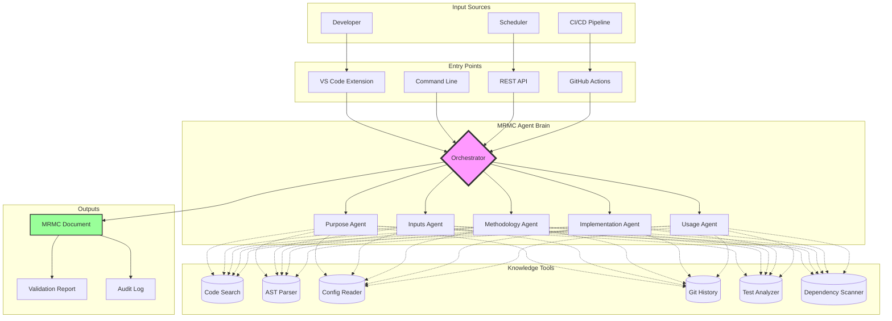

## 2. Agent Communication Flow

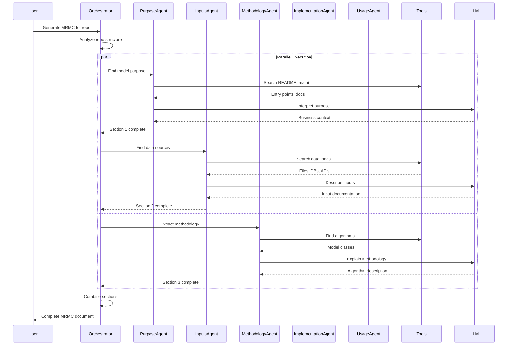

## 3. Tool Usage Pattern

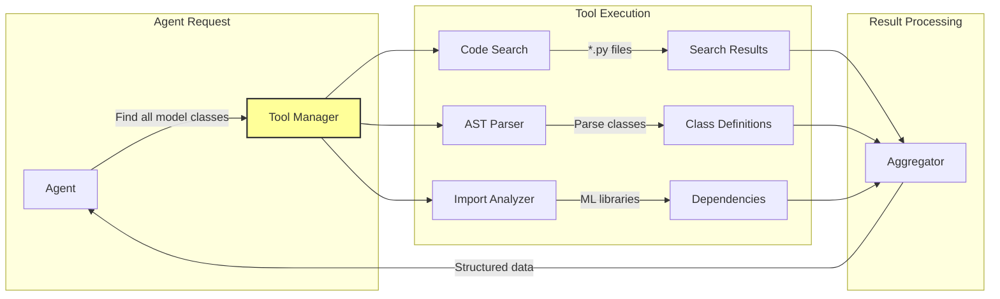

## 4. Document Generation Pipeline

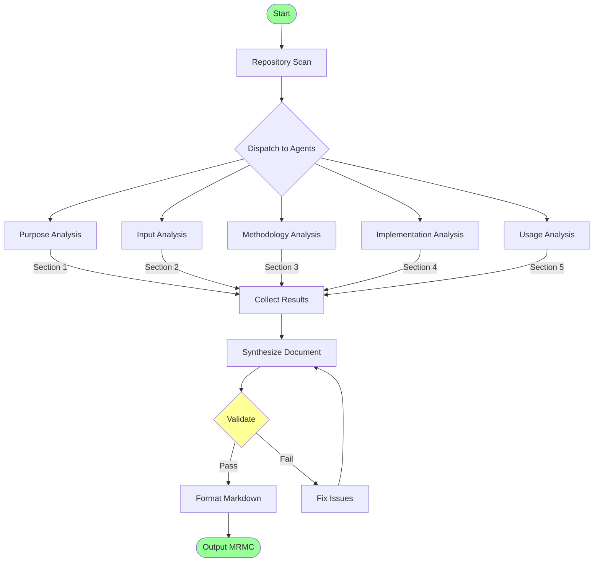

## 5. VS Code Integration Flow

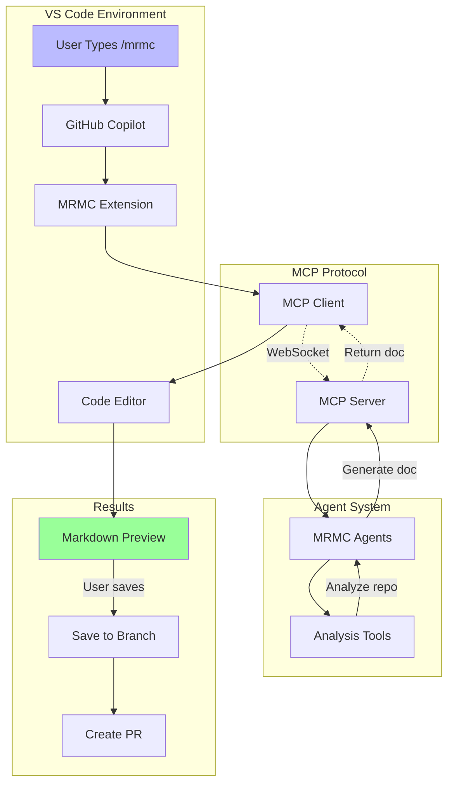

## 6. CI/CD Integration Pipeline

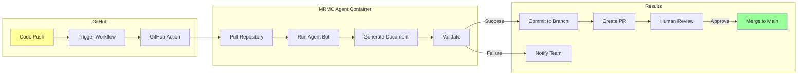

## 7. Data Flow Through Agents

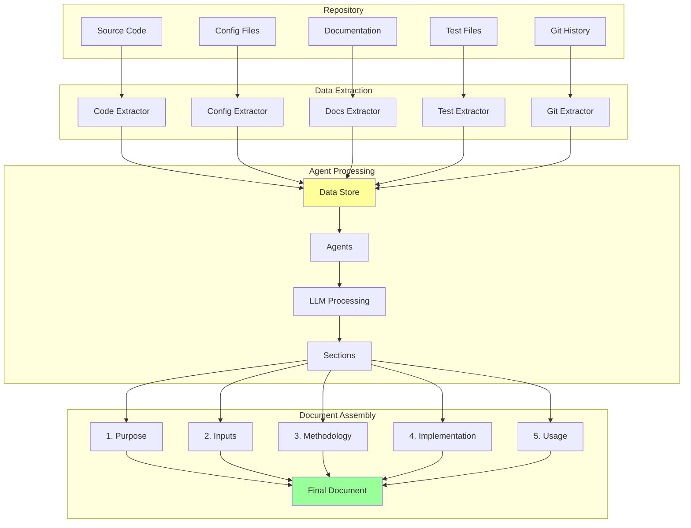

## 8. Error Handling & Recovery

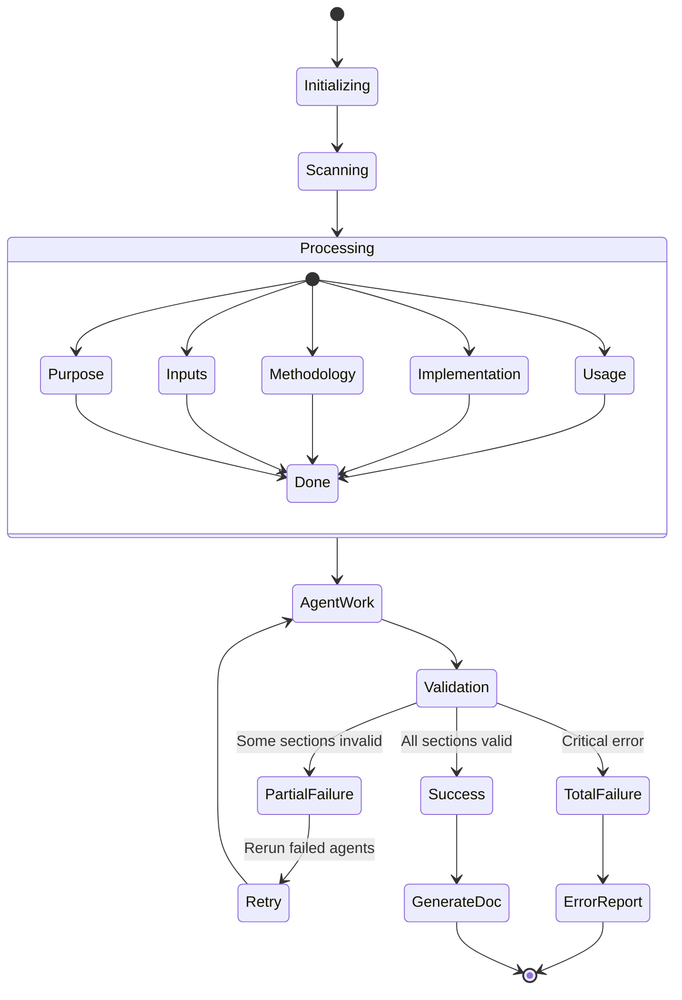

## 9. Tool Architecture

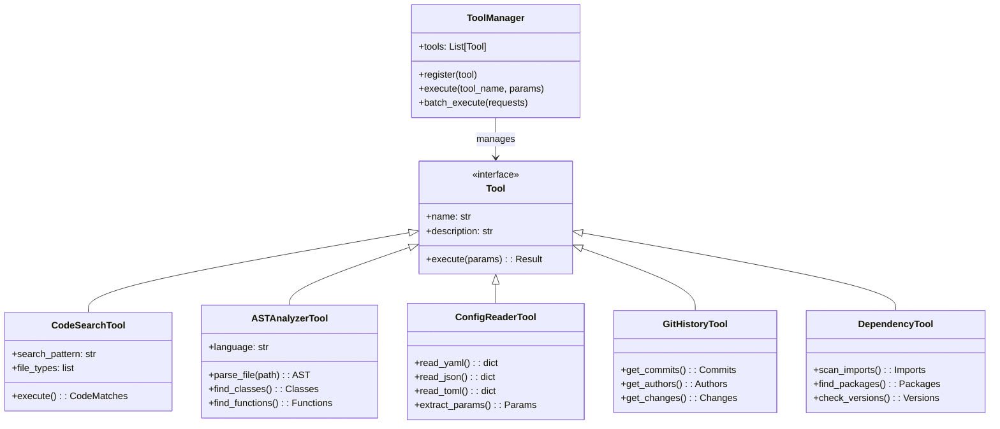

## 10. Deployment Architecture

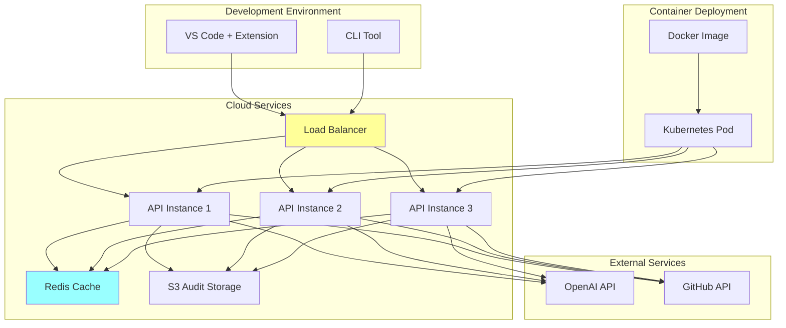

## 11. Security & Audit Flow

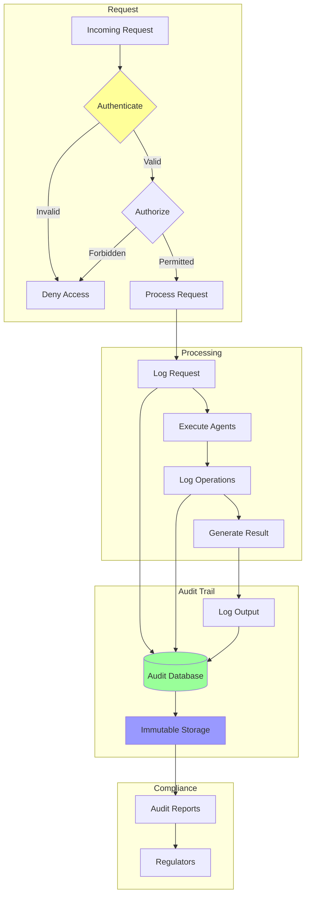

## 12. Performance Optimization

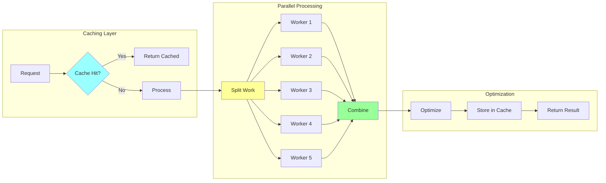

These diagrams illustrate:

1. **System Overview**: How all components connect
2. **Agent Communication**: How agents collaborate
3. **Tool Usage**: How tools serve agents
4. **Generation Pipeline**: Step-by-step document creation
5. **VS Code Integration**: IDE workflow
6. **CI/CD Pipeline**: Automated generation
7. **Data Flow**: Information movement through system
8. **Error Handling**: Failure recovery mechanisms
9. **Tool Architecture**: Object-oriented design
10. **Deployment**: Production infrastructure
11. **Security & Audit**: Compliance tracking
12. **Performance**: Optimization strategies

Each diagram tells a different part of the story, making it easy to explain the system to different audiences - from developers to executives to regulators.